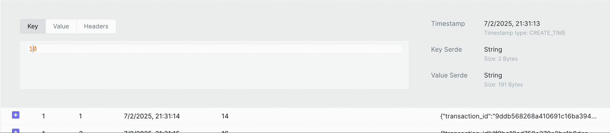

# 📟 Kafka in Docker


My goal with this repository is to have a Kafka template that I can setup locally
and use it in other projects as well, so I don't have to copy/paste not maintaing
this code/configs in every repo I need a local kafka instance.

I hope this can be useful to you too.

I really tried to create things in a simpler and very well documented way.  
Plus, I've already left a simple script that will propagate some data for you,
so you can start doing some test faster.

Here is the **project structure** 👇

```bash
.
├── Dockerfile               # 🐋 Dockerfile with Kafka setup.
├── docker-compose.yml      # 🧩 Docker compose configuring the service.
├── resources/
│   ├── kafka/
│   │   ├── start-kafka.sh  # 🆙 Initialization script for Kafka.
│   │   └── *.properties    # 📝 Kafka properties with custom configs.
│   └── kafka-ui/
│       └── *               # 📝 Kafka UI config.
└── scripts/
    └── *.sh                # ⚙️ Some scripts to propagate some random data.
```

> 💡 More details about the **scripts** [here](./scripts/README.md).  
> 💡 More details about **releasing a new image** [here](./.docs/CONTRIBUTING.md).

## Try It Out 🍩

Don't want to write your own producer just to see messages flowing?  
This repo ships with a script that publishes random fake DonutCoin transactions to a
`DONU_TRANSACTIONS_V1` topic, so you can start playing with real messages in seconds.



> 💡 Check the [scripts docs](./scripts/README.md) for the full payload example and how to run it.

## Getting Started

Commnands to up the Kafka Cluster locally 

<details>
<summary>Show setup commands 👇</summary>

```bash
# 👇 Creates "kafka-dev" image locally
docker compose build

# Starts...
#  - The Kafka Cluster
#  - The Kafka UI at 👉 http://localhost:8080/
docker compose up
```

> If `docker compose` doesn't work for you, try `docker-compose`.  
> If it still doesn't work, check if you have docker compose installed.

</details>

### Playground

Here are some terminal commands you can try to explore your own Kafka 😎

<details>
<summary>Show playground commands 👇</summary>

```bash
# Creating a topic 👇
docker compose exec kafka-dev kafka-topics.sh \
    --create \
    --bootstrap-server "localhost:9092" \
    --replication-factor "1" \
    --partitions "1" \
    --topic "MY_TOPIC"

# Checking the available topics 👇
docker compose exec kafka-dev kafka-topics.sh --list --bootstrap-server "localhost:9092"

# Producing messages 👇
docker compose exec kafka-dev kafka-console-producer.sh \
    --bootstrap-server "localhost:9092" \
    --topic "MY_TOPIC"

# Consuming messages 👇
docker compose exec kafka-dev kafka-console-consumer.sh \
    --bootstrap-server "localhost:9092" \
    --topic "MY_TOPIC" --from-beginning

# Checking the consumer groups 👇
docker compose exec kafka-dev kafka-consumer-groups.sh \
    --all-groups \
    --describe \
    --bootstrap-server "localhost:9092"
```

</details>

### Useful Links

- [Apache Kafka](https://kafka.apache.org/downloads)
- [Kafka Tool - UI Tool 4 Kafka](https://www.kafkatool.com/download.html)
- [Medium: Learning in Practice](https://medium.com/trainingcenter/apache-kafka-codifica%C3%A7%C3%A3o-na-pratica-9c6a4142a08f)
