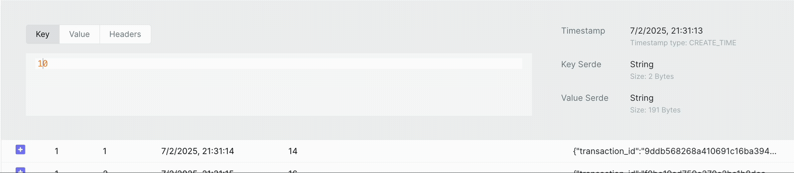

# ⚙️ Custom Scripts

How can you use the custom scripts?

### 01 - Kafka Dev Service in Your Project

You need to configure a `kafka-dev` service in your other project, like this 👇

```yml
# docker-compose.yml
services:
    kafka-dev:
        image: avcaliani/kafka-in-docker
        container_name: kafka-dev
        ports:
            - 9092:9092 # Kafka
```

### 02 - Execute the Script

#### DonutCoin Transactions 🍩

Publishes random messages to a Kafka topic `DONU_TRANSACTIONS_V1`.
The messages are simple JSONs that represent some fake DonutCoin transactions.

> DonutCoin (DONU) – plays on Homer’s love for donuts 🍩

Executing the script 👇

```bash
docker compose exec kafka-dev /opt/scripts/donu-transactions.sh
```

Payload Example 👇



```json
{
    "transaction_id": "82e4648eba623c53a22e3b6fbec9308f77d8a27631d74358a2176ed315330a7b",
    "timestamp": "2025-04-07T20:47:06Z",
    "from": "16",
    "to": "20",
    "amount": 7.63421,
    "currency": "DONU",
    "fee": 0.38171
}
```
